# ✈️ Next Destination — Travel & Tour Booking Platform

A modern, responsive, frontend-only travel marketing and demo booking website built with **React 19**, **Vite**, and **Tailwind CSS v4**. 

**Next Destination** lets travelers discover worldwide destinations, book curated tour packages with day-by-day itineraries, reserve boutique hotels and flights, build custom trip timelines, browse a masonry photo gallery, and leave reviews. It also includes a simulated **Admin Dashboard** for managing users, reservations, and tour packages—all operating entirely in the browser using `localStorage` without requiring any external backend or database.

---

## 🛠️ Tech Stack & Packages

### Core Dependencies & Commands

You can install all packages at once with:
```bash
npm install
```

Or install them manually with the following commands:

#### Production Dependencies
```bash
npm install react react-dom react-router-dom lucide-react
```

| Package | Version | Purpose |
| :--- | :--- | :--- |
| **`react`** | `^19.2.4` | Core React framework for building functional component UI |
| **`react-dom`** | `^19.2.4` | DOM bindings for React |
| **`react-router-dom`** | `^7.1.0` | Client-side routing, navigation links, and parameter hooks |
| **`lucide-react`** | `^0.469.0` | Travel and UI icon library (planes, stars, compasses, etc.) |

#### Development Dependencies
```bash
npm install -D vite @vitejs/plugin-react tailwindcss @tailwindcss/vite
```

| Package | Version | Purpose |
| :--- | :--- | :--- |
| **`vite`** | `^8.0.1` | High-performance build tool and local dev server |
| **`@vitejs/plugin-react`** | `^6.0.1` | Official Vite plugin providing React Fast Refresh |
| **`tailwindcss`** | `^4.2.2` | Utility-first CSS framework for custom responsive styling |
| **`@tailwindcss/vite`** | `^4.2.2` | Vite plugin integrating Tailwind CSS v4 |
| **Google Fonts** | CDN | *Poppins* (headings) + *Inter* (body) loaded via `index.html` |
| **Context & Storage** | Built-in | React Context API (`AuthContext`) backed by `localStorage` |

---

## ✨ Key Features

- **🌍 Destination Catalog & Smart Filters**:
  - Explore 10 global destinations (Bali, Paris, Santorini, Dubai, Kyoto, Swiss Alps, Maldives, New York, Cape Town, Bangkok).
  - Real-time client-side search by destination name or country.
  - Category filtering (*Beach, Mountain, City, Adventure, Romantic*) and budget price ranges.
  - Dedicated destination detail pages with travel highlights, weather recommendations, and related tour packages.

- **🎒 Curated Tour Packages**:
  - Complete multi-day tour packages with duration, per-person pricing, and inclusions checklists.
  - Interactive day-by-day itinerary accordion.
  - Dynamic guest selector and one-click booking that saves directly into your personal itinerary.

- **🏨 Hotel Reservations**:
  - Browse luxury resorts and boutique hotels with amenity tags and nightly rates.
  - Interactive check-in and check-out date pickers with automatic night calculation and total price estimates.
  - Reservation confirmation modal saving bookings to `localStorage`.

- **✈️ Flight Search & Booking**:
  - Route finder with origin, destination, and departure date selectors.
  - Airline schedule cards displaying departure/arrival times, stops, and flight durations.
  - One-click flight reservation flow.

- **📅 Interactive Itinerary Builder**:
  - Chronological timeline combining all booked packages, hotels, flights, and personal day activities.
  - Custom note builder allowing travelers to add their own custom day notes and stops.
  - Budget tracker summarizing total estimated trip expenditure.
  - Single-item removal, clear all, and print-ready itinerary view (`window.print()`).

- **📸 Masonry Photo Gallery & Lightbox**:
  - Responsive multi-column masonry layout (`columns-2 md:columns-3 lg:columns-4`).
  - Full-screen lightbox overlay with photo captions, locations, and Escape key navigation.

- **⭐ Traveler Reviews & Interactive Rating**:
  - Community feed displaying real traveler reviews.
  - "Leave a Review" form with interactive 5-star scoring and auto-filled traveler name when logged in.

- **📩 Contact Concierge**:
  - Inquiry form with client-side field validation and success confirmation.
  - Headquarters details, operational hours, and an embedded Google Maps view.

- **🛡️ Authentication & Role-Based Admin Panel**:
  - User registration and login simulated with `localStorage`.
  - Protected admin routes guarded by `ProtectedAdminRoute`.
  - **Admin Dashboard**: Live metric cards tracking total users, bookings, packages, and estimated revenue.
  - **Manage Users**: Table of seed and registered travelers with account removal capability.
  - **Manage Bookings**: View all reservations across flights, hotels, and tours with cancellation support.
  - **Manage Packages**: Create and publish new tour packages instantly to the live website.

---

## 📸 Screenshots

### 1. Home & Hero Section
*Hero banner with quick destination search, value badges, and featured tours.*

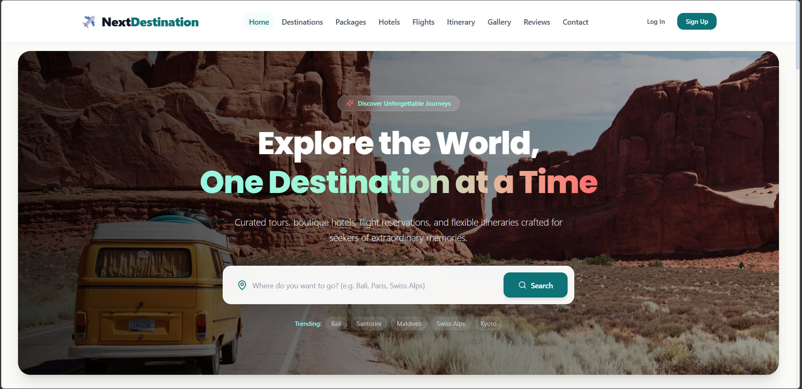

### 2. Destination Catalog & Filters
*Real-time search bar, category filter pills, and destination cards.*

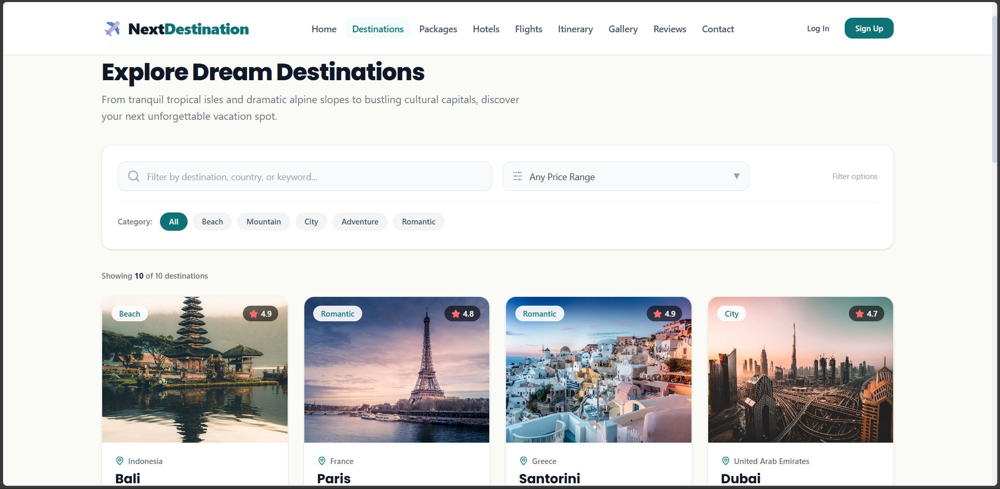

### 3. Destination Detail Page
*Hero imagery, travel highlights, weather guide, and destination-specific tour packages.*

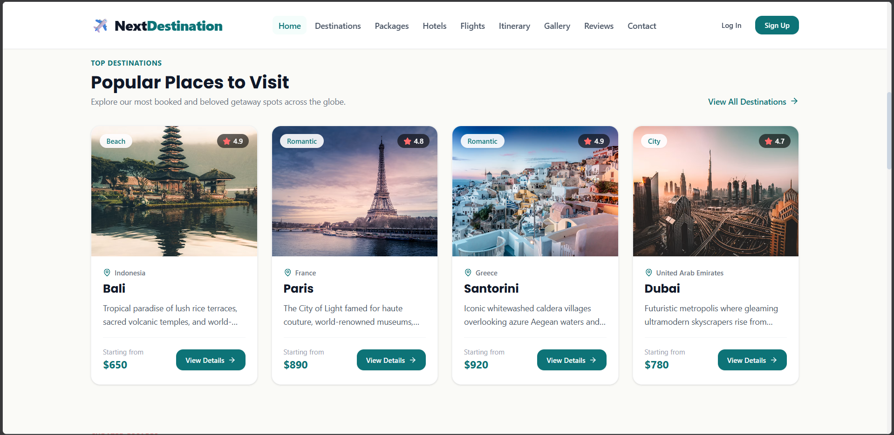

### 4. Tour Package & Accordion Itinerary
*Package overview, guest count selector, inclusions list, and day-by-day accordion.*

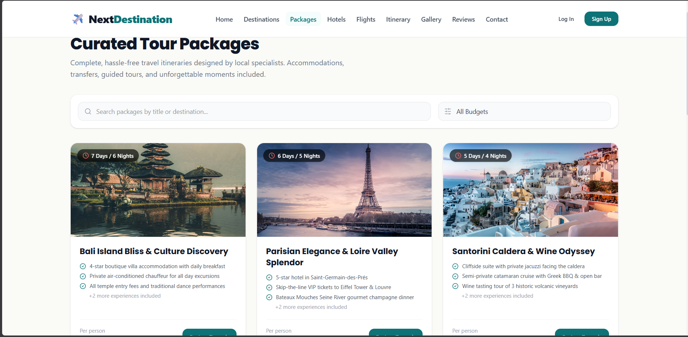

### 5. Hotel Booking & Date Picker Modal
*Hotels grid with date pickers, calculated stay length, and booking modal.*

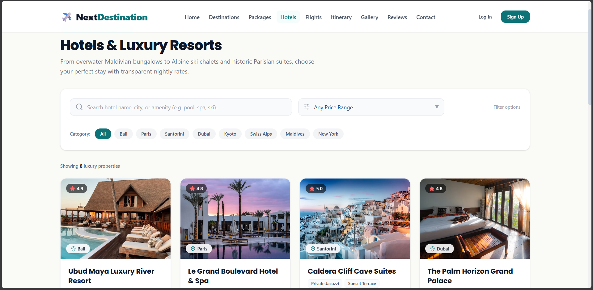

### 6. Flight Search Engine
*Airline routes, departure/arrival schedules, and direct flight reservation.*

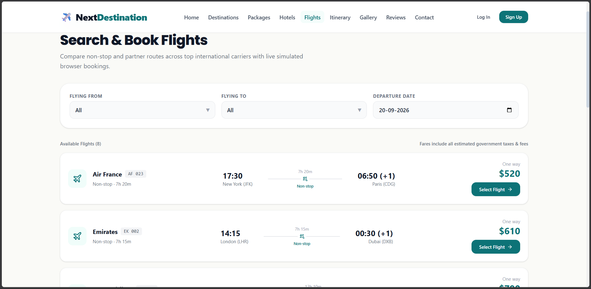

### 7. Trip Itinerary & Custom Timeline
*Aggregated bookings timeline with custom notes and estimated trip cost.*

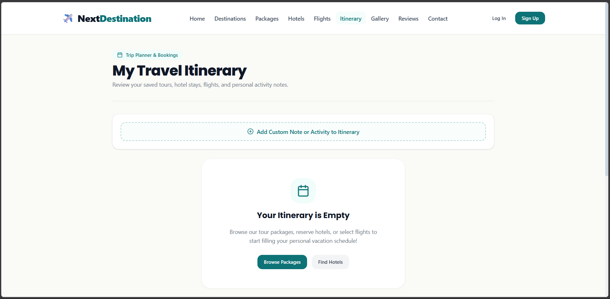

### 8. Masonry Photo Gallery & Lightbox
*Responsive Pinterest-style photo grid and enlarged lightbox view.*

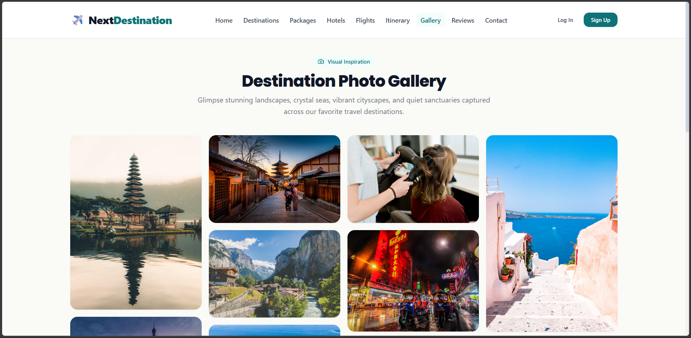

### 9. Reviews & Interactive Star Rating
*Community review cards and interactive star-rating submission form.*

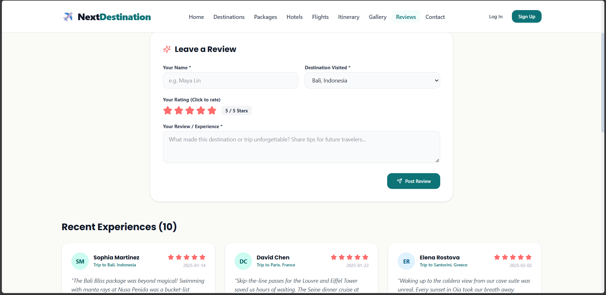

### 10. Contact Concierge
*Customer message form, company info, and embedded Google Maps.*

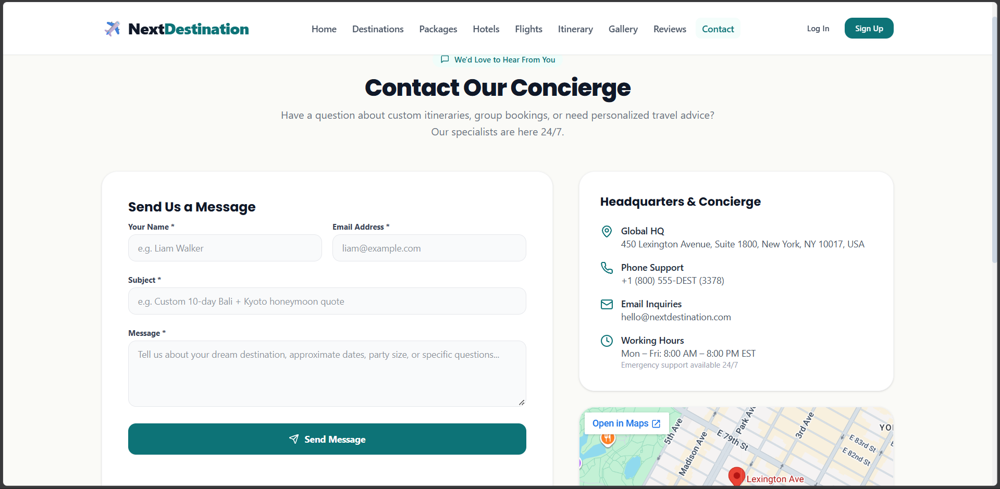

### 11. Admin Dashboard & Metrics
*Administrator overview with KPI stat cards and recent booking activity.*

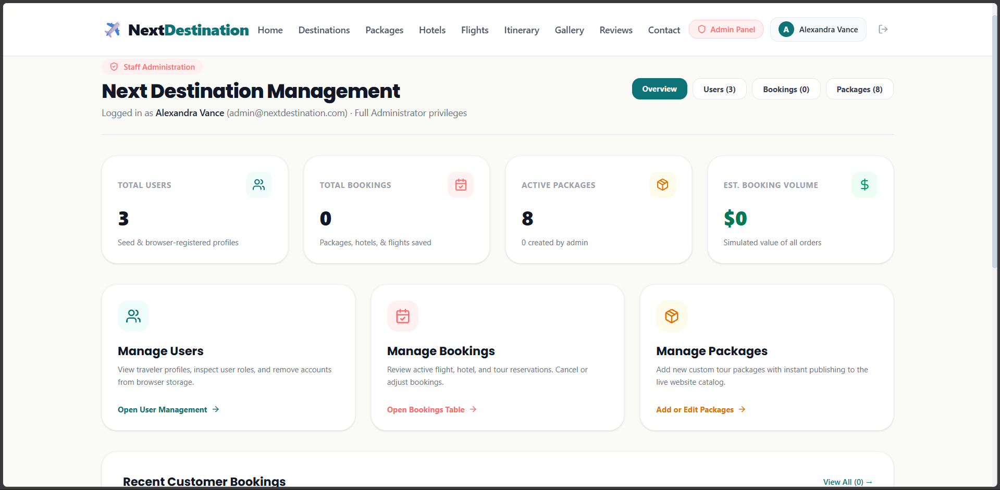

### 12. Admin Package Management
*Form to create new tours and table of live published packages.*

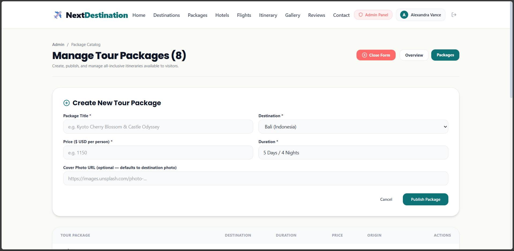

---

## 🚀 Getting Started

### Prerequisites
- [Node.js](https://nodejs.org/) (version 18.0 or higher recommended)
- `npm` or `yarn`

### Installation

1. Navigate to the project root directory:
   ```bash
   cd next-destination
   ```

2. Install dependencies:
   ```bash
   npm install
   ```

3. Start the local development server:
   ```bash
   npm run dev
   ```

4. Open your browser and navigate to:
   ```
   http://localhost:5173
   ```

### Building for Production

To create an optimized production build:
```bash
npm run build
```

To preview the production build locally:
```bash
npm run preview
```

---

## 🔑 Demo Credentials

You can log in using pre-configured demo credentials or create your own account on the registration page:

| Role | Email | Password | Access Level |
| :--- | :--- | :--- | :--- |
| **Administrator** | `admin@nextdestination.com` | `admin123` | Full access to `/admin` dashboard, bookings, users, and package creation |
| **Traveler** | `sarah@traveler.com` | `password123` | Standard traveler access |

*(Quick-fill buttons are also provided on the `/login` page for convenience).*

---

## 📄 License

This project is open source and available under the [MIT License](LICENSE).
